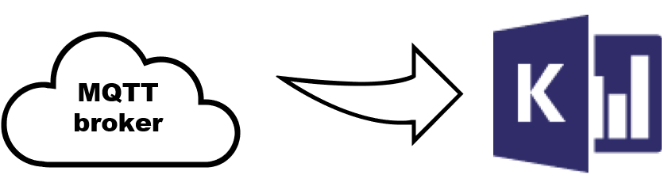
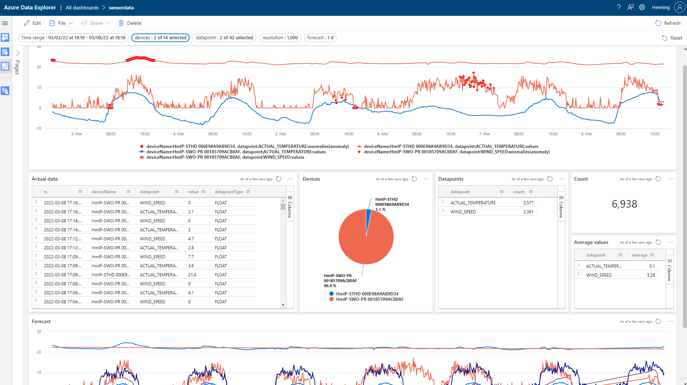

# mqttToKusto



[](https://github.com/cosh/mqttToKusto/actions/workflows/dotnet.yml)

MqttToKusto is a simple tool to subscribe to 1..N topics of an MQTT broker and send that data directly to Kusto ([Azure Data Explorer](https://azure.microsoft.com/services/data-explorer/), [Azure Synapse Data Explorer](https://docs.microsoft.com/azure/synapse-analytics/data-explorer/data-explorer-overview), [MyFreeCluster](https://aka.ms/kustofree)). It's written in C# (.net core) and it runs on a all kinds of devices or operating systems.

Configuration:

```
{
  "Settings": {
    "APPINSIGHTS_INSTRUMENTATIONKEY": "",
    "MqttURL": "IP or url here",
    "MqttClientId": "some unique id",
    "Kusto": {
      "ClientId": "service principal client id",
      "ClientSecret": "service principal client secret",
      "TenantId": "azure ad tenant",
      "ClusterName": "<clustername>.<azureRegion>",
      "DbName": "kusto database name",
      "MaxRetries": 10,
      "MsBetweenRetries": 60000
    },
    "Subscriptions": [
      {
        "MqttTopic": "sensor",
        "KustoTable": "raw",
        "MappingName": "map",
        "BatchLimitInMinutes": 5,
        "BatchLimitNumberOfEvents": "1000"
      },
      {
        "MqttTopic": "steckdose",
        "KustoTable": "steckdose",
        "MappingName": "map",
        "BatchLimitInMinutes": 10,
        "BatchLimitNumberOfEvents": "1000"
      },
      {
        "MqttTopic": "forecast",
        "KustoTable": "forecast",
        "MappingName": "map",
        "BatchLimitInMinutes": 10,
        "BatchLimitNumberOfEvents": "1000"
      },
      {
        "MqttTopic": "pvsensor",
        "KustoTable": "pvsensor",
        "MappingName": "map",
        "BatchLimitInMinutes": 10,
        "BatchLimitNumberOfEvents": "1000"
      },
      {
        "MqttTopic": "homematicsensor",
        "KustoTable": "homematicsensor",
        "MappingName": "map",
        "BatchLimitInMinutes": 10,
        "BatchLimitNumberOfEvents": "1000"
      }
    ]
  }
}
```

Have phun sending data kusto and create beautiful visualizations using the [dashboards](https://dataexplorer.azure.com/dashboards).


